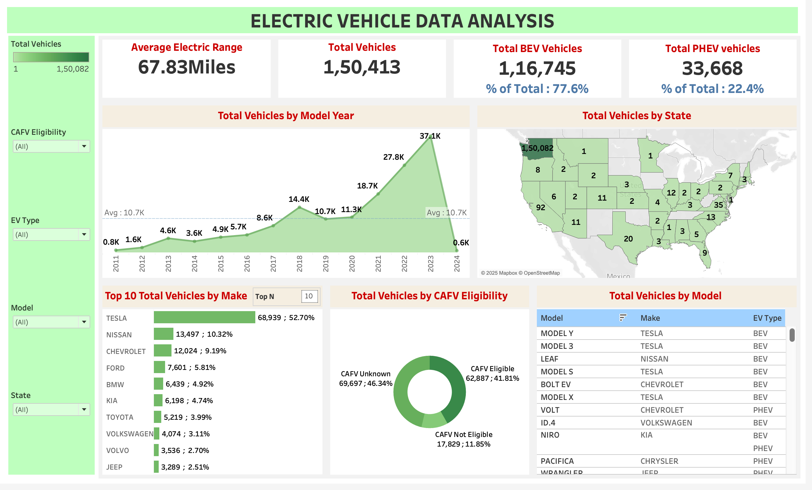

# 🚗 Electric Vehicle (EV) Data Analysis Project

**Project Duration**: [20/04/2025] - [22/04/2025]  
**Tools Used**: SQL (MySQL), Python (Jupyter Notebook), Tableau  
**Dataset**: [Download](/Data/)

---

## 📌 **Project Overview**
This project analyzes EV adoption trends, performance metrics, and geographic distribution using a multi-tool approach:
- **SQL**: Data extraction and aggregation  
- **Python**: Advanced analysis/visualization  
- **Tableau**: Interactive dashboard and useful sheets  

## 📂 **Folder Structure**
```text
EV_Data_Analysis/
├── SQL/                                   # SQL scripts for data querying
│   ├── data_queries.md                    # Database creation and queries
│   └── results/                           # Exported query results (PNG)
│
├── Python/                                # Jupyter Notebook
│   ├── ElectricVehicle_DataAnalysis.ipynb # Main analysis notebook
│
├── Tableau/                               # Tableau workbook and exports
│   ├── EV_DataAnalysis.twbx               # Interactive dashboard
│   ├── dashboard_overview.png             # Img of dashboard
│
└── Data/                                  # Raw and processed dataset
    ├── ElectricVehiclePopulationData.csv  # Original CSV file
```

## 🔍 **Key Analysis Steps**

### 1. **SQL Phase** ([View Queries](/SQL/data_queries.md))
- Created database `DataAnalysis` and imported EV registration data.
- Executed 10 analytical queries, including:
  - Top 5 cities by EV adoption (`seattle` leads with 25,675 vehicles)
  - Range analysis (Jaguar has 87% vehicles with 200+ mile range)
  - Tesla dominance (Model Y = 28,456 units, 3x competitors)

### 2. **Python Phase** ([View Notebook](/Python/))
- Data Cleaning and Preparation
- Exploratory Data Analysis (EDA)
- Machine Learning Applications
    - Clustering
    - Classification (CAFV Eligibility)
    - Regression (Electric Range Prediction)
    - Anomaly Detection
- Unique Market Insights
    - EV Market Segmentation
    - Price vs. Range Trends
    - Geographic Distribution by Price Segment

### 3. **Tableau Phase** ([View Dashboard Interactively](/Tableau/))
Built an interactive dashboard with:
- Overall EV Statistics (Total Vehicles, Avg. Electric Range, BEV vs. PHEV Count & Percentage)
- Vehicle Adoption Trends by Model Year
- Geographic Distribution of Total Vehicles by State
- Top Vehicle Manufacturers by Total Count
- Distribution of Vehicles by CAFV Eligibility
- Breakdown of Total Vehicles by Specific Model, Make, and EV Type




## 🛠 **Setup Instructions**
1. **Database Setup**:
   ```sql
   CREATE DATABASE DataAnalysis;
   USE DataAnalysis;
   ```
   Import data using your SQL client's wizard
   
2. **Python Dependencies:**

```bash
pip install pandas matplotlib seaborn plotly xgboost
```
3. **Tableau:**
Open `.twbx file` in Tableau Desktop/Public.

## 📝 Future Work
- Incorporate charging station data for correlation analysis.
- Predict EV adoption using ML (Python/scikit-learn).
- Expand to multi-state datasets.

## 🙋 Questions?
Contact: [pondurijayakrishna@gmail.com] | [https://www.linkedin.com/in/jayakrishna77/]

