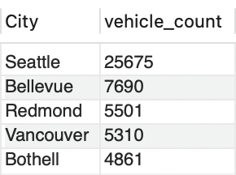
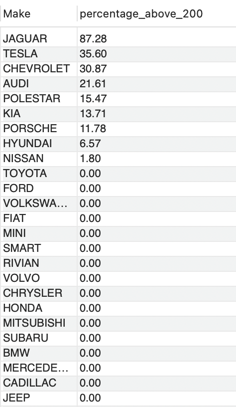
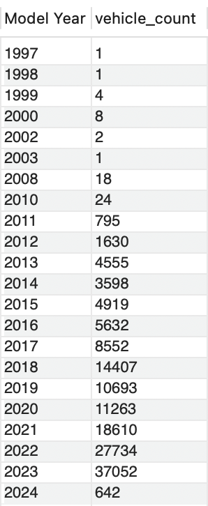
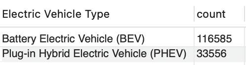
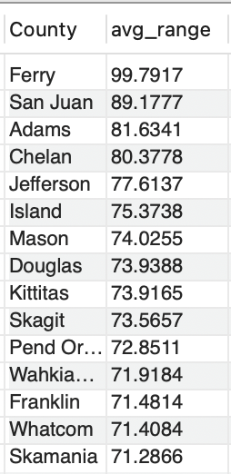
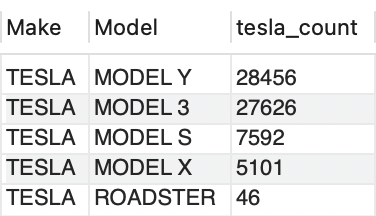
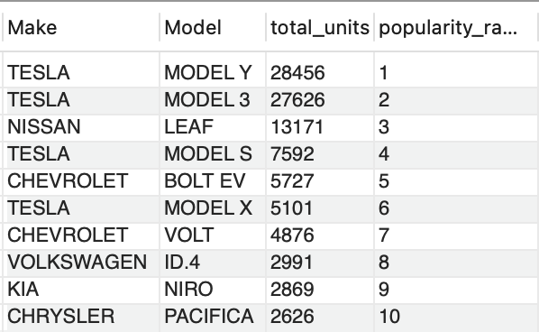
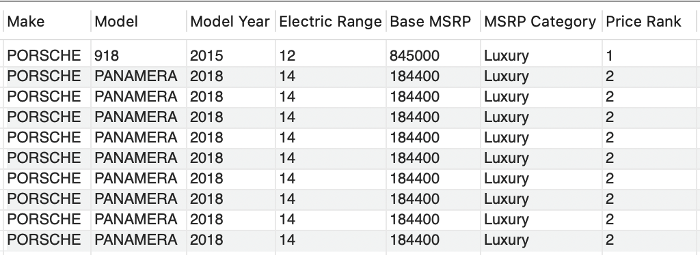
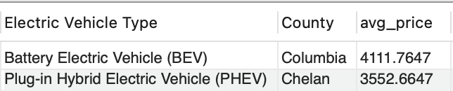

# Electric Vehicle (EV) Data Analysis with SQL
## 📖  Introduction
This project involves analyzing electric vehicle (EV) data using a combination of SQL, Python, and Tableau. The objective is to uncover insights into electric vehicle market trends, such as year-wise sales growth, top-performing models, and pricing distribution. SQL is used to query and retrieve data, Python is used for data cleaning and analysis, and Tableau is used for interactive visualizations. This document includes the SQL queries executed and their respective output screenshots.

## Dataset Overview
The dataset contains:
- **Geographic Information**:
  - `Country`
  - `City`
  - `State`
  - `Postal Code`
  - `Legislative District`
  - `Vehicle Location`
  - `2020 Census Tract`
- **Vehicle Identification**
  - `VN (1-10)` (Likely a unique identifier or sequence number)
  - `DOL Vehicle` (Department of Licensing identifier)
  - `Make`
  - `Model`
  - `Model Year`
- **Technical Specifications**
  - `Electric Vehicle Type` (e.g., BEV, PHEV)
  - `Clean Alternative Fuel Vehicle (CAFV) Eligibility`

- **Infrastructure & Utilities**
  - `Electric Utility` (Service provider for charging)

## Configuration 
### Step 1: Create Database
Run `CREATE DATABASE DataAnalysis;`   
then `USE DataAnalysis;`

### Step 2: Import Data (Using Wizard)

Right-click your database in SQL client

Select `"Import Data"` → `"From File"`

Choose your EV dataset (CSV/Excel)

Follow wizard steps to map columns

Click `"Finish"` to import

## Queries 

### -- 1. Top 5 Cities with the Highest Number of Electric Vehicles

```sql
SELECT City, COUNT(*) AS vehicle_count  
FROM electric_vehicle_population_data  
GROUP BY City  
ORDER BY vehicle_count DESC  
LIMIT 5;
```
<p>
  
</p>

### -- 2 .What is the percentage of vehicles with an Electric Range above 200 miles for each Make?

```sql
SELECT Make, ROUND(SUM(CASE WHEN `Electric Range` > 200 THEN 1 ELSE 0 END) / COUNT(*) * 100, 2) AS percentage_above_200  
FROM electric_vehicle_population_data  
GROUP BY Make  
ORDER BY percentage_above_200 DESC;  
```

<p>
  
</p>


### -- 3. Number of Vehicles by Model Year (Trend Analysis)

```sql
SELECT `Model Year`, COUNT(*) AS vehicle_count
FROM electric_vehicle_population_data
GROUP BY `Model Year`
ORDER BY `Model Year` ASC;
```
<p>
  
</p>

### -- 4. What is the earliest and latest Model Year for each Make?

```sql
SELECT Make, MIN(`Model Year`) AS earliest_year, MAX(`Model Year`) AS latest_year
FROM electric_vehicle_population_data
GROUP BY Make
ORDER BY Make;
```
<p>
  
</p>

### -- 5. Count of Plug-in Hybrid vs Battery Electric Vehicles

```sql
SELECT `Electric Vehicle Type`, COUNT(*) AS count
FROM electric_vehicle_population_data
GROUP BY `Electric Vehicle Type`;
```

<p>
  
</p>

### -- 6. Average Electric Range by Country (Insight on regional performance)

```sql
SELECT County, AVG(`Electric Range`) AS avg_range
FROM electric_vehicle_population_data
GROUP BY County
ORDER BY avg_range DESC
LIMIT 15;
```
<p>
  
</p>

### -- 7. Total Number of Tesla Vehicles by Model

```sql
SELECT `Make`, `Model`, COUNT(*) AS tesla_count
FROM electric_vehicle_population_data
WHERE Make = 'TESLA'
GROUP BY Model
ORDER BY tesla_count DESC;
```
<p>
  
</p>

### -- 8. Top 10 Rank Models by Popularity (Vehicle Count) Using a Window Function

```sql
SELECT Make, Model, COUNT(*) AS total_units,
       RANK() OVER (ORDER BY COUNT(*) DESC) AS popularity_rank
FROM electric_vehicle_population_data
GROUP BY Make, Model
ORDER BY popularity_rank ASC
LIMIT 10;
```
<p>
  
</p>

### -- 9. Show the top 10 electric vehicles (by Base MSRP) along with their Make, Model, Model Year, Electric Range, MSRP Category, and Price Rank overall.
```sql
SELECT Make,
       Model,
       `Model Year`,
       `Electric Range`,
       `Base MSRP`,
       CASE 
           WHEN `Base MSRP` >= 80000 THEN 'Luxury'
           WHEN `Base MSRP` BETWEEN 50000 AND 79999 THEN 'Mid-Range'
           ELSE 'Budget'
       END AS `MSRP Category`,
       RANK() OVER (ORDER BY `Base MSRP` DESC) AS `Price Rank`
FROM electric_vehicle_population_data
ORDER BY `Base MSRP` DESC
LIMIT 10;
```

<p>
  
</p>


### -- 10.Find the County with the Highest Average MSRP for Each Electric Vehicle Type

```sql
SELECT t1.`Electric Vehicle Type`, t1.County, t1.avg_price
FROM (
    SELECT `Electric Vehicle Type`, County, AVG(`Base MSRP`) AS avg_price
    FROM electric_vehicle_population_data
    GROUP BY `Electric Vehicle Type`, County
) AS t1
JOIN (
    SELECT `Electric Vehicle Type`, MAX(avg_price) AS max_price
    FROM (
        SELECT `Electric Vehicle Type`, County, AVG(`Base MSRP`) AS avg_price
        FROM electric_vehicle_population_data
        GROUP BY `Electric Vehicle Type`, County
    ) AS t2
    GROUP BY `Electric Vehicle Type`
) AS t3
ON t1.`Electric Vehicle Type` = t3.`Electric Vehicle Type`
AND t1.avg_price = t3.max_price
ORDER BY t1.`Electric Vehicle Type`;
```

<p>
  
</p>


## 🔍 Key Observations from the Analysis
### 🌍 Geographic Distribution
  - **Seattle dominates EV adoption** with **25,675** registered EVs - more than triple second-place Bellevue (7,690)
  - **Top 5 cities (Seattle, Bellevue, Redmond, Vancouver, Bothell)** account for ~30% of all EVs in the dataset
  - **Rural counties show lower adoption rates**, with Ferry County having the lowest average EV range (99 miles)

### 🔋 EV Performance & Technology
  - **Jaguar leads in long-range EVs** (87% of models exceed 200 miles), followed by Tesla (36%)
  - **Surprising underperformers:** Toyota, Ford, and Volkswagen have 0% of vehicles exceeding 200-mile range
  - **BEVs outnumber PHEVs 3:1** (116,585 vs 33,556), signaling market preference for pure electric vehicles

### 🚗 Market Trends & Brand Performance
  - **Tesla dominates** with Model Y (28,456) and Model 3 (27,626) as top-selling models
  - **Nissan Leaf remains strong** at #3 (13,171 units) despite newer competition
  - **Market evolution:**
    - Early adopters (1997-2010): Minimal presence (<100 vehicles)
    - Growth phase (2011-2017): Steady increase (5,000-8,500 annual registrations)
    - Boom period (2018-2024): 14,000-37,000 annual registrations

### 💰 Pricing & Market Segments
  - **Columbia County has highest average BEV price** (4,112)whileChelanleadsinPHEVs(3,553)
  - **Premium brands dominate long-range segment:** Jaguar, Tesla, Audi, Polestar
  - **Budget brands** (Toyota, Nissan, Ford) focus on sub-200-mile range vehicles
  - **Luxury EVs** (MSRP ≥ $80K) are concentrated in affluent counties.
  - **Mid-range** (50K–80K) and **budget** (<$50K) segments show different adoption patterns.


## 🔮 Key Takeaways
1. **Urban tech hubs drive adoption** - Seattle metro accounts for disproportionate share

2. **Range remains premium feature** - Only 5 brands have >20% of vehicles exceeding 200 miles

3. **Tesla's market dominance is structural** - Holds 4 of top 6 most popular models

4. **BEVs winning over PHEVs** - 3:1 ratio suggests charging infrastructure improvements

5. **Rural areas lag significantly** in both adoption rates and available vehicle ranges

## 📈 Recommended Next Steps
1. **Correlate charging infrastructure density** with adoption rates by city

2. **Analyze state incentives** impact on brand preferences

3. **Study used EV market** - How do older models (pre-2015) perform in secondary markets?

4. **Compare Tesla's service network coverage** vs other brands in rural areas

## Conclusion

This analysis reveals **strong geographic and economic trends** in EV adoption, with **Tesla leading in both technology and market penetration**. Future growth may depend on **expanding charging networks, lowering costs, and improving battery efficiency** to attract mainstream buyers.


